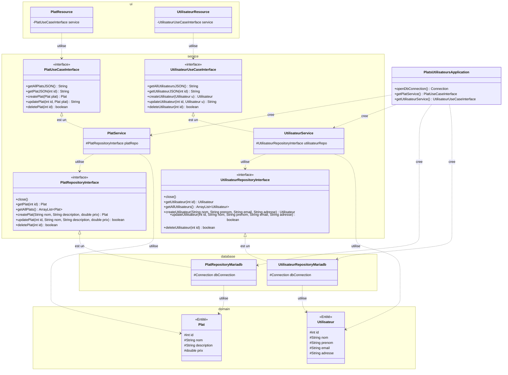

# Diagramme de classes

Les interfaces UseCase (PlatUseCaseInterface, UtilisateurUseCaseInterface) dans la couche ui ne sont pas obligatoires, on pourrait directement utiliser PlatService et UtilisateurService. On les a mises pour respecter le cours et avoir une architecture plus propre, comme ca si on change l'implementation du service, le controller n'est pas impacte.
